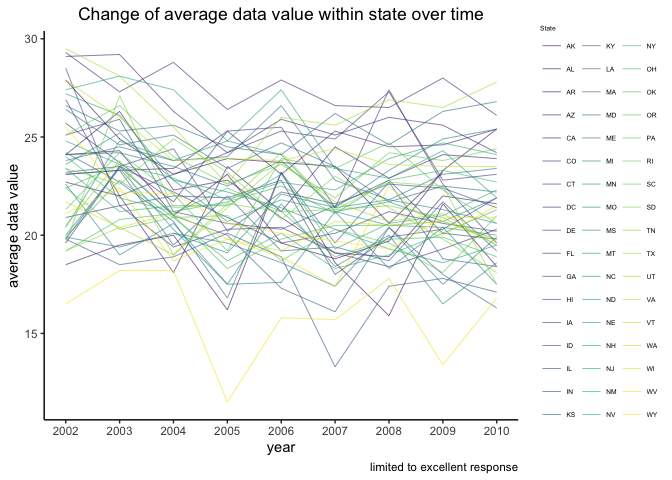
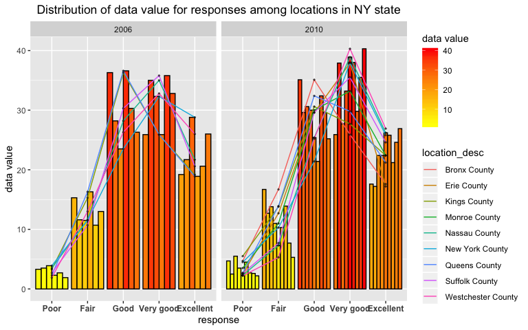
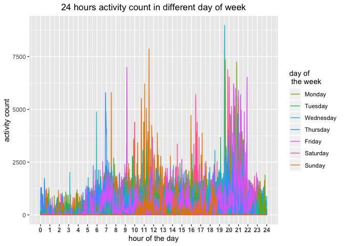

p8105\_hw3\_fj2269
================
Fangming Jin
2019/10/4

### Question 1

**Step 1: describe the dataset**

Instacart dataset contains 1384617 observation of 15 variable. Each
observation represents an product from an order in Instacart online
grocery. Each variable records a service information about this product.
The variable of the dataset is as
follow:

| variable                  | description                                               |
| :------------------------ | :-------------------------------------------------------- |
| order\_id                 | order identifier                                          |
| product\_id               | product identifier                                        |
| add\_to\_cart\_order      | order in which each product was added to cart             |
| reordered                 | if this prodcut has been ordered by this user in the past |
| user\_id                  | customer identifier                                       |
| eval\_set                 | which evaluation set this order belongs in                |
| order\_number             | order sequence number for this user                       |
| order\_dow                | day of the week on which the order was placed             |
| order\_hour\_of\_day      | hour of the day on which the order was placed             |
| days\_since\_prior\_order | days since the last order                                 |
| product\_name             | name of the product                                       |
| aisle\_id                 | aisle identifier                                          |
| department\_id            | department identifier                                     |
| aisle                     | name of the aisle                                         |
| department                | name of the department                                    |

Instacart dataset has row for observation and column for variable. One
row correspond to one observation, recording all kinds of information of
an observation. One column corresponds to one variable, recording one
information of all observations.

We will use the observation to
illustrate:

| order\_id | product\_id | add\_to\_cart\_order | reordered | user\_id | eval\_set | order\_number | order\_dow | order\_hour\_of\_day | days\_since\_prior\_order | product\_name    | aisle\_id | department\_id | aisle  | department |
| :-------- | :---------- | :------------------- | :-------- | :------- | :-------- | :------------ | :--------- | :------------------- | :------------------------ | :--------------- | :-------- | :------------- | :----- | :--------- |
| 1         | 49302       | 1                    | 1         | 112108   | train     | 4             | 4          | 10                   | 9                         | Bulgarian Yogurt | 120       | 16             | yogurt | dairy eggs |

This observation shows information above

*a) Target product is Bulgarian Yogurt (id: 49302). It belongs to yogurt
aisle (id: 120), dairy eggs departments (id: 16).*

*b) It is bought by user 49302 in his/her fourth order(id: 1) at 10 am,
fourth day of the month.*

*c) Bulgarian Yogurt has been bought by user 49302 before and was
firstly added to cart in this order.*

*d) This order belongs to train evaluation.*

**Step two: characteristic of aisle**

*There are 134 aisle in the dataset, and most items are ordered from
fresh vegetables*

**Step three: make a plot on number of products ordered in each aisle**

<!-- -->

*There are 39 aisles that meet our requirement. If we rank the aisles
with more than 10000 orders, we will see the product count of orders
exponentially grows as the rank rises. Higher the rank of an aisle is,
greater the gap of count between it and aisle with bigger rank. And top2
aisle, fresh fruits and fresh vegetables, have highest product counts
and exceed other asiles.*

**Step 4: make a table showing the three most popular items and ordered
number in “baking ingredients”, “dog food care”, and “packaged
vegetables fruits”**

    ## # A tibble: 9 x 4
    ## # Groups:   aisle [3]
    ##   aisle                product_name                       item_number Rank 
    ##   <chr>                <chr>                                    <int> <chr>
    ## 1 baking ingredients   Light Brown Sugar                          499 Top 1
    ## 2 baking ingredients   Pure Baking Soda                           387 Top 2
    ## 3 baking ingredients   Cane Sugar                                 336 Top 3
    ## 4 dog food care        Snack Sticks Chicken & Rice Recip~          30 Top 1
    ## 5 dog food care        Organix Chicken & Brown Rice Reci~          28 Top 2
    ## 6 dog food care        Small Dog Biscuits                          26 Top 3
    ## 7 packaged vegetables~ Organic Baby Spinach                      9784 Top 1
    ## 8 packaged vegetables~ Organic Raspberries                       5546 Top 2
    ## 9 packaged vegetables~ Organic Blueberries                       4966 Top 3

*The top 3 product in packaged vegetables fruits is Organic Baby
Spinach, Organic Raspberries, Organic Blueberries, the top 3 product in
dog food care is Snack Sticks Chicken & Rice Recipe Dog Treats, Organix
Chicken & Brown Rice Recipe, Small Dog Biscuits, the top 3 product in
baking ingredients is Light Brown Sugar, Pure Baking Soda, Cane Sugar.
Packaged vegetables fruits have top 3 products that sells best comparing
with top 3 in baking ingredients and dog food care. Dog food care’s top
3 have the lowest sell comparing with other two aisle.*

**Step 5: make a table showing the mean hour of the day at which Pink
Lady Apples and Coffee Ice Cream are ordered on each day of the
week**

|  product\_name   | Monday | Tuesday | Wednesday | Thurday | Friday | Saturday | Sunday |
| :--------------: | :----: | :-----: | :-------: | :-----: | :----: | :------: | :----: |
| Coffee Ice Cream | 14.32  |  15.38  |   15.32   |  15.22  | 12.26  |  13.83   | 13.77  |
| Pink Lady Apples | 11.36  |  11.70  |   14.25   |  11.55  | 12.78  |  11.94   | 13.44  |

*The sell of coffee ice cream increases from Monday to Tuesday and
remains in a high level from Tuesday to Thurday, on Friday it decreases
,reaches the lowest point and remains a steady low level from Friday to
Sunday. During the middle of the week, people like to buy coffee ice
cream and as for weekend, they do not.*

*The sell of pink lady apples increases from Monday to Wednesday and
reach a peak on Wednesday, it decreases on Thurday and remains a steady
low level from Thurday to Sunday. On Wednesday, people would like to buy
pink lady apples while on other days of the week, they do not.*

### Question 2

**Step 1: Data Clean**

    ## # A tibble: 10,625 x 23
    ##     year location_abbr location_desc class topic question response
    ##    <int> <chr>         <chr>         <chr> <chr> <chr>    <fct>   
    ##  1  2010 AL            " Jefferson ~ Heal~ Over~ How is ~ Excelle~
    ##  2  2010 AL            " Jefferson ~ Heal~ Over~ How is ~ Very go~
    ##  3  2010 AL            " Jefferson ~ Heal~ Over~ How is ~ Good    
    ##  4  2010 AL            " Jefferson ~ Heal~ Over~ How is ~ Fair    
    ##  5  2010 AL            " Jefferson ~ Heal~ Over~ How is ~ Poor    
    ##  6  2010 AL            " Mobile Cou~ Heal~ Over~ How is ~ Excelle~
    ##  7  2010 AL            " Mobile Cou~ Heal~ Over~ How is ~ Very go~
    ##  8  2010 AL            " Mobile Cou~ Heal~ Over~ How is ~ Good    
    ##  9  2010 AL            " Mobile Cou~ Heal~ Over~ How is ~ Fair    
    ## 10  2010 AL            " Mobile Cou~ Heal~ Over~ How is ~ Poor    
    ## # ... with 10,615 more rows, and 16 more variables: sample_size <int>,
    ## #   data_value <dbl>, confidence_limit_low <dbl>,
    ## #   confidence_limit_high <dbl>, display_order <int>,
    ## #   data_value_unit <chr>, data_value_type <chr>,
    ## #   data_value_footnote_symbol <chr>, data_value_footnote <chr>,
    ## #   data_source <chr>, class_id <chr>, topic_id <chr>, location_id <chr>,
    ## #   question_id <chr>, resp_id <chr>, geo_location <chr>

**Step 2: find out states that were observed at 7 or more locations**

*In 2002, state including CT, FL, MA, NC, NJ, PA were observed at 7 or
more locations.* *In 2010, state including CA, CO, FL, MA, MD, NC, NE,
NJ, NY, OH, PA, SC, TX, WA were observed at 7 or more locations.* *The
number of observed states in 2010 is greater than that of 2006.*

**Step 3.1: summarize average of data value across locations within a
state over year**

    ## # A tibble: 443 x 3
    ## # Groups:   year [9]
    ##     year location_abbr mean_data_value
    ##    <int> <chr>                   <dbl>
    ##  1  2002 AK                       27.9
    ##  2  2002 AL                       18.5
    ##  3  2002 AR                       24.1
    ##  4  2002 AZ                       24.1
    ##  5  2002 CA                       22.7
    ##  6  2002 CO                       23.1
    ##  7  2002 CT                       29.1
    ##  8  2002 DC                       29.3
    ##  9  2002 DE                       20.9
    ## 10  2002 FL                       25.7
    ## # ... with 433 more rows

**Step 3.2: Spaghetti plot of average data value over time within a
state**

<!-- -->

*At the individual level, the average data value of a state always
fluctuates irregularly as time passes. And we cannot find regulation of
average data value if we only observe value change across time in
different state separately. An the level of state as a whole, The
average data value remain stable as year pass globally .*

**Step 4: make a plot showing distribution of data value for responses
among locations in NY state**

<!-- -->

*The distribution of data value for response in 2006 and 2010 are
similar among location in NY state. Poor responce has the lowest data
value, data value of fair response ranks last but one among value of
different responses. data value of Good and very good response are
highest, in some location, data value of good response is higher than
that of very good response, in others it is opposite. Excellent reponse
has the third highest data value.*

### Question 3

**Step 1: tidy and wrangle the data**

    ## Parsed with column specification:
    ## cols(
    ##   .default = col_double(),
    ##   day = col_character()
    ## )

    ## See spec(...) for full column specifications.

    ## # A tibble: 50,400 x 6
    ##     week day_id day    minute activity_count weekday_weekend
    ##    <dbl>  <dbl> <fct>   <dbl>          <dbl> <chr>          
    ##  1     1      2 Monday      1              1 Weekday        
    ##  2     1      2 Monday      2              1 Weekday        
    ##  3     1      2 Monday      3              1 Weekday        
    ##  4     1      2 Monday      4              1 Weekday        
    ##  5     1      2 Monday      5              1 Weekday        
    ##  6     1      2 Monday      6              1 Weekday        
    ##  7     1      2 Monday      7              1 Weekday        
    ##  8     1      2 Monday      8              1 Weekday        
    ##  9     1      2 Monday      9              1 Weekday        
    ## 10     1      2 Monday     10              1 Weekday        
    ## # ... with 50,390 more rows

*There is 50400 observation of 6 variable in accel dataset above. Each
observation represents a record of activity counts for each minute of a
24-hour day starting at midnight. We recorded five weeks of
accelerometer data from a 63 year-old male.*

*As for variable: Week means the week that activity counts is recorded.
Day means which day of the week that activity counts is recorded. Minute
means the minute of day that activity counts is recorded. Day\_id means
id of the day. Activity\_value means the activity counts value.*

**Step 2: Make a table showing the total activity variable for each
day**

    ## # A tibble: 35 x 4
    ##     week day       day_id sum_act
    ##    <dbl> <fct>      <dbl>   <dbl>
    ##  1     1 Monday         2  78828.
    ##  2     1 Tuesday        6 307094.
    ##  3     1 Wednesday      7 340115.
    ##  4     1 Thursday       5 355924.
    ##  5     1 Friday         1 480543.
    ##  6     1 Saturday       3 376254 
    ##  7     1 Sunday         4 631105 
    ##  8     2 Monday         9 295431 
    ##  9     2 Tuesday       13 423245 
    ## 10     2 Wednesday     14 440962 
    ## # ... with 25 more rows

*There is no apperent trend as total activity count changes day by day.
The fluctuation of total activity count over time is violent. We may
need to observe the data in another way.*

**Step 3: 24 hours activity count in different day of week**

<!-- -->

*According to this graph, there are two peak of activity count during 24
hours, first peak is from 7:00 to 11:00, second peak is from 20:00 to
22:00. And there is a trough of activity from midnight to 6:00.*
